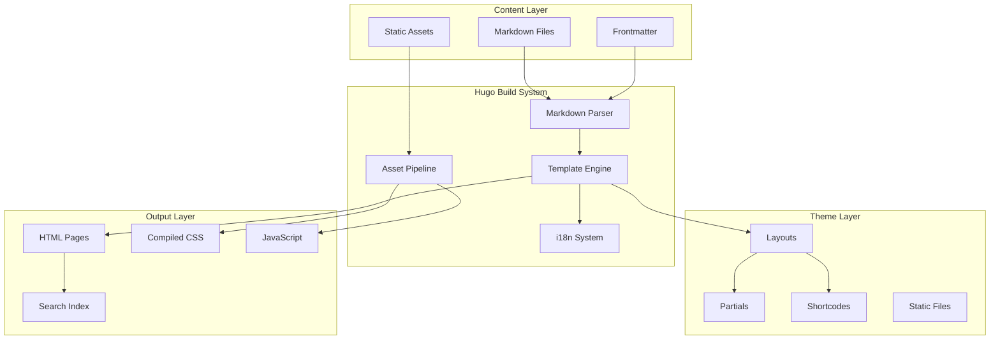
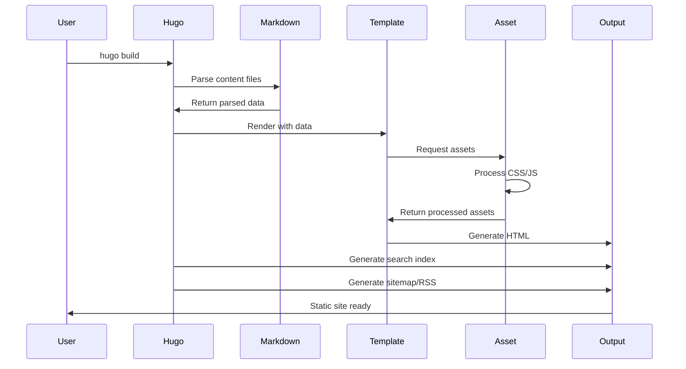
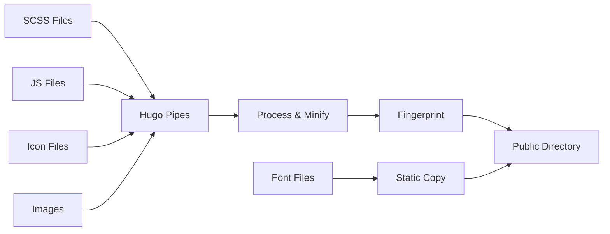

# 技术设计文档：Astro 博客迁移至 Hugo

## Overview

本设计文档描述了将 KIRARI Astro 博客项目完整迁移至 Hugo 静态站点生成器的技术实现方案。该项目是一个功能丰富的多语言博客系统，包含复杂的组件系统、插件架构、样式系统和内容管理功能。

### 设计目标

1. **功能完整性**: 在 Hugo 平台上重现所有 Astro 功能和特性
2. **内容保真**: 确保所有内容（文章、页面、资源）完整迁移且格式正确
3. **性能优化**: 利用 Hugo 的高性能构建能力，提升网站加载速度
4. **开发体验**: 提供良好的开发和维护体验
5. **可扩展性**: 设计灵活的架构，便于未来功能扩展

### 技术栈选择

- **静态站点生成器**: Hugo v0.120+
- **样式系统**: TailwindCSS + SCSS（从 Stylus 转换）
- **搜索引擎**: Pagefind
- **代码高亮**: Hugo 内置 Chroma
- **图表渲染**: Mermaid.js（客户端）
- **数学公式**: KaTeX（客户端）
- **图片灯箱**: PhotoSwipe
- **交互增强**: Alpine.js 或 Vanilla JavaScript
- **页面过渡**: Swup.js

### 关键技术决策

1. **使用 Hugo Modules 而非传统主题**: 采用 Hugo Modules 架构，便于组件化和版本管理
2. **混合渲染策略**: 核心内容使用 Hugo 模板渲染，交互功能使用客户端 JavaScript
3. **渐进式迁移**: 优先迁移核心功能，然后逐步添加高级特性
4. **保持 URL 结构**: 确保迁移后的 URL 与原站点一致，避免 SEO 损失
5. **配置优先**: 通过配置文件控制功能开关，减少代码修改

## Architecture

### 系统架构图



### Hugo 项目结构

```
hugo-blog/
├── archetypes/              # 内容模板
│   └── default.md
├── assets/                  # 需要处理的资源
│   ├── css/
│   │   ├── main.scss
│   │   ├── markdown.scss
│   │   ├── variables.scss
│   │   └── components/
│   ├── js/
│   │   ├── main.js
│   │   ├── theme-switcher.js
│   │   ├── search.js
│   │   └── components/
│   └── icons/
├── content/                 # 内容文件
│   ├── posts/              # 博客文章
│   │   ├── _index.md
│   │   └── *.md
│   ├── about/
│   │   └── _index.md
│   ├── friends/
│   │   └── _index.md
│   └── archive/
│       └── _index.md
├── data/                    # 数据文件
│   ├── friends.json
│   ├── tag_mappings.json
│   └── category_mappings.json
├── i18n/                    # 多语言翻译
│   ├── en.yaml
│   ├── zh-CN.yaml
│   ├── zh-TW.yaml
│   ├── ja.yaml
│   └── ...
├── layouts/                 # 布局模板
│   ├── _default/
│   │   ├── baseof.html     # 基础布局
│   │   ├── single.html     # 单页布局
│   │   ├── list.html       # 列表布局
│   │   └── index.html      # 首页布局
│   ├── partials/           # 可复用组件
│   │   ├── head.html
│   │   ├── header.html
│   │   ├── footer.html
│   │   ├── sidebar.html
│   │   ├── post-card.html
│   │   ├── post-meta.html
│   │   ├── toc.html
│   │   ├── pagination.html
│   │   └── ...
│   ├── shortcodes/         # 短代码
│   │   ├── github-card.html
│   │   ├── github-file-card.html
│   │   ├── note.html
│   │   ├── tip.html
│   │   └── ...
│   ├── posts/              # 文章专用布局
│   │   ├── single.html
│   │   └── list.html
│   ├── taxonomy/           # 分类法布局
│   │   ├── tag.html
│   │   ├── category.html
│   │   └── terms.html
│   └── 404.html
├── static/                  # 静态文件
│   ├── fonts/
│   ├── images/
│   ├── favicon.ico
│   └── robots.txt
├── config/                  # 配置文件（分环境）
│   ├── _default/
│   │   ├── config.yaml
│   │   ├── params.yaml
│   │   ├── menus.yaml
│   │   └── languages.yaml
│   ├── development/
│   └── production/
├── scripts/                 # 辅助脚本
│   ├── new-post.sh
│   ├── migrate-content.js
│   └── convert-styles.js
└── hugo.yaml               # 主配置文件
```

### 数据流设计



## Components and Interfaces

### 核心组件映射

#### 1. Layout Components

| Astro Component | Hugo Equivalent | 实现方式 |
|----------------|-----------------|---------|
| Layout.astro | layouts/_default/baseof.html | Hugo 基础模板 |
| MainGridLayout.astro | layouts/partials/main-grid.html | Partial 模板 |

#### 2. Navigation Components

| Astro Component | Hugo Equivalent | 实现方式 |
|----------------|-----------------|---------|
| Navbar.astro | layouts/partials/header.html | Partial + Hugo Menu |
| Footer.astro | layouts/partials/footer.html | Partial + Params |
| SideBar.astro | layouts/partials/sidebar.html | Partial + Widgets |

#### 3. Content Components

| Astro Component | Hugo Equivalent | 实现方式 |
|----------------|-----------------|---------|
| PostCard.astro | layouts/partials/post-card.html | Partial |
| PostMeta.astro | layouts/partials/post-meta.html | Partial |
| ArchivePanel.astro | layouts/partials/archive-panel.html | Partial |
| TOC.astro | layouts/partials/toc.html | Hugo .TableOfContents |
| Pagination.astro | layouts/partials/pagination.html | Hugo .Paginator |

#### 4. Widget Components

| Astro Component | Hugo Equivalent | 实现方式 |
|----------------|-----------------|---------|
| Profile.astro | layouts/partials/widgets/profile.html | Partial + Params |
| Categories.astro | layouts/partials/widgets/categories.html | Partial + Taxonomy |
| Tags.astro | layouts/partials/widgets/tags.html | Partial + Taxonomy |

#### 5. Interactive Components

| Astro Component | Hugo Equivalent | 实现方式 |
|----------------|-----------------|---------|
| Search.astro | layouts/partials/search.html + assets/js/search.js | Partial + Pagefind |
| LightDarkSwitch.astro | layouts/partials/theme-switcher.html + assets/js/theme.js | Partial + JS |
| DisplaySettings.astro | layouts/partials/display-settings.html + assets/js/settings.js | Partial + JS |
| BackToTop.astro | layouts/partials/back-to-top.html + assets/js/scroll.js | Partial + JS |

#### 6. Shortcodes

| Astro Component | Hugo Equivalent | 实现方式 |
|----------------|-----------------|---------|
| GithubCardComponent.astro | layouts/shortcodes/github-card.html | Shortcode |
| GithubFileCardComponent.astro | layouts/shortcodes/github-file-card.html | Shortcode |
| License.astro | layouts/partials/license.html | Partial |

### 组件接口设计

#### Partial 接口规范

所有 Partial 组件遵循以下接口规范：

```go
// Context 对象包含：
// . (dot) - 当前页面上下文
// .Site - 站点全局配置
// .Params - 页面参数
// .Page - 页面对象

// 示例：Post Card Partial
{{- $post := . -}}
{{- $title := $post.Title -}}
{{- $description := $post.Description | default $post.Summary -}}
{{- $date := $post.Date -}}
{{- $tags := $post.Params.tags -}}
{{- $category := $post.Params.category -}}
{{- $image := $post.Params.image -}}
```

#### Shortcode 接口规范

```go
// Shortcode 参数通过 .Get 访问
// 位置参数：.Get 0, .Get 1, ...
// 命名参数：.Get "name"
// 内部内容：.Inner

// 示例：GitHub Card Shortcode
// 使用方式：
{{- $repo := .Get "repo" -}}
{{- $owner := index (split $repo "/") 0 -}}
{{- $name := index (split $repo "/") 1 -}}
```

### Markdown 扩展接口

#### Hugo Markdown 配置

```yaml
markup:
  goldmark:
    renderer:
      unsafe: true  # 允许 HTML
    parser:
      attribute: true  # 支持属性
      autoHeadingID: true
      autoHeadingIDType: github
    extensions:
      definitionList: true
      footnote: true
      linkify: true
      strikethrough: true
      table: true
      taskList: true
      typographer: true
  highlight:
    anchorLineNos: false
    codeFences: true
    guessSyntax: false
    hl_Lines: ""
    lineAnchors: ""
    lineNoStart: 1
    lineNos: true
    lineNumbersInTable: true
    noClasses: false
    style: github-dark
    tabWidth: 4
```

#### 自定义 Render Hooks

Hugo 支持通过 Render Hooks 自定义 Markdown 元素的渲染：

```
layouts/
└── _default/
    └── _markup/
        ├── render-image.html      # 自定义图片渲染
        ├── render-link.html       # 自定义链接渲染
        ├── render-heading.html    # 自定义标题渲染
        └── render-codeblock.html  # 自定义代码块渲染
```

## Data Models

### Content Schema

#### Post Frontmatter Schema

```yaml
# 必填字段
title: string              # 文章标题
published: date            # 发布日期 (YYYY-MM-DD)

# 可选字段
updated: date              # 更新日期 (YYYY-MM-DD)
description: string        # 文章描述/摘要
image: string              # 封面图片路径
tags: array<string>        # 标签列表
category: string           # 分类
draft: boolean             # 草稿状态，默认 false
lang: string               # 语言代码，默认继承站点语言
mermaid: boolean           # 是否启用 Mermaid，默认 false
math: boolean              # 是否启用数学公式，默认 false
toc: boolean               # 是否显示目录，默认 true
comments: boolean          # 是否启用评论，默认 true

# Hugo 自动生成字段
date: date                 # Hugo 使用 published 映射到 date
lastmod: date              # Hugo 使用 updated 映射到 lastmod
```

#### Page Frontmatter Schema

```yaml
title: string              # 页面标题
description: string        # 页面描述
layout: string             # 布局类型
type: string               # 内容类型
```

### Configuration Schema

#### Site Configuration

```yaml
baseURL: string            # 站点 URL
languageCode: string       # 默认语言代码
title: string              # 站点标题
theme: string              # 主题名称（如使用主题）
defaultContentLanguage: string  # 默认内容语言
enableRobotsTXT: boolean   # 启用 robots.txt
enableGitInfo: boolean     # 启用 Git 信息
paginate: integer          # 每页文章数
summaryLength: integer     # 摘要长度
buildDrafts: boolean       # 构建草稿
buildFuture: boolean       # 构建未来日期的内容
```

#### Parameters Schema

```yaml
params:
  # 站点信息
  author: string
  description: string
  keywords: array<string>
  
  # 个人资料
  profile:
    name: string
    bio: string
    avatar: string
    links: array<object>
      - name: string
        url: string
        icon: string
  
  # 导航配置
  navbar:
    logo: string
    links: array<object>
      - name: string
        url: string
        external: boolean
  
  # 功能开关
  features:
    search: boolean
    toc: boolean
    comments: boolean
    mermaid: boolean
    math: boolean
    photoswipe: boolean
  
  # 主题配置
  theme:
    defaultMode: string      # light, dark, auto
    colorFixed: boolean
    defaultHue: integer      # 0-360
  
  # SEO 配置
  seo:
    googleVerification: string
    bingVerification: string
    yandexVerification: string
    naverVerification: string
  
  # 许可协议
  license:
    enabled: boolean
    name: string
    url: string
  
  # LLMs 文档
  llms:
    enable: boolean
    i18n: boolean
    title: string
    description: string
  
  # 自定义 HTML/Script
  customHead: string
  customFooter: string
```

#### Menu Configuration

```yaml
menus:
  main:
    - identifier: home
      name: Home
      url: /
      weight: 1
    - identifier: archive
      name: Archive
      url: /archive/
      weight: 2
    - identifier: about
      name: About
      url: /about/
      weight: 3
    - identifier: friends
      name: Friends
      url: /friends/
      weight: 4
    - identifier: github
      name: GitHub
      url: https://github.com/username
      weight: 5
      params:
        external: true
```

#### Languages Configuration

```yaml
languages:
  en:
    languageName: English
    weight: 1
    params:
      languageFlag: 🇺🇸
  zh-CN:
    languageName: 简体中文
    weight: 2
    params:
      languageFlag: 🇨🇳
  zh-TW:
    languageName: 繁體中文
    weight: 3
    params:
      languageFlag: 🇹🇼
  ja:
    languageName: 日本語
    weight: 4
    params:
      languageFlag: 🇯🇵
  # ... 其他语言
```

#### Taxonomy Configuration

```yaml
taxonomies:
  tag: tags
  category: categories

# 分类法映射数据（data/tag_mappings.json）
{
  "web_dev": {
    "name": "Web开发",
    "slug": "web-dev",
    "description": "Web 开发相关技术"
  },
  "javascript": {
    "name": "JavaScript",
    "slug": "javascript",
    "description": "JavaScript 编程语言"
  }
}

# 分类映射数据（data/category_mappings.json）
{
  "tech": {
    "name": "技术",
    "slug": "tech",
    "description": "技术文章"
  },
  "life": {
    "name": "生活",
    "slug": "life",
    "description": "生活随笔"
  }
}
```

### Data Files Schema

#### Friends Data

```json
{
  "friends": [
    {
      "title": "Friend Name",
      "description": "Friend description",
      "url": "https://example.com",
      "avatar": "https://example.com/avatar.jpg"
    }
  ]
}
```

#### i18n Translation Schema

```yaml
# i18n/en.yaml
home: Home
about: About
archive: Archive
search: Search
friends: Friends
tags: Tags
categories: Categories
recentPosts: Recent Posts
allPosts: All Posts
readMore: Read More
readingTime: "{{ .Count }} min read"
wordCount: "{{ .Count }} words"
publishedOn: Published on
updatedOn: Updated on
tableOfContents: Table of Contents
backToTop: Back to Top
previousPost: Previous Post
nextPost: Next Post
noPostsFound: No posts found
searchPlaceholder: Search articles...
lightMode: Light Mode
darkMode: Dark Mode
autoMode: Auto Mode
themeColor: Theme Color
displaySettings: Display Settings
license: License
```

### Asset Pipeline Data Flow



### Search Index Schema

Pagefind 生成的搜索索引结构：

```json
{
  "url": "/posts/example-post/",
  "title": "Example Post Title",
  "excerpt": "Post excerpt or description...",
  "content": "Full post content...",
  "meta": {
    "date": "2024-01-01",
    "tags": ["tag1", "tag2"],
    "category": "category1"
  },
  "filters": {
    "language": "en",
    "tags": ["tag1", "tag2"],
    "category": "category1"
  }
}
```


## Correctness Properties

*A property is a characteristic or behavior that should hold true across all valid executions of a system—essentially, a formal statement about what the system should do. Properties serve as the bridge between human-readable specifications and machine-verifiable correctness guarantees.*

### Property 1: Configuration Conversion Preserves Semantics

*For any* valid Astro configuration file (astro.config.mjs and constants.ts), converting it to Hugo configuration format should preserve all semantic meaning, such that the Hugo site behaves equivalently to the Astro site.

**Validates: Requirements 1.2, 14.1-14.13**

### Property 2: Content Conversion Preserves Markdown Body

*For any* Markdown content file, the content body (excluding frontmatter) should remain identical after conversion from Astro to Hugo format.

**Validates: Requirements 2.3**

### Property 3: Frontmatter Conversion Preserves All Fields

*For any* valid Astro frontmatter, converting it to Hugo frontmatter should preserve all fields (title, published→date, updated→lastmod, description, image, tags, category, draft, lang, mermaid, math).

**Validates: Requirements 2.2, 2.7**

### Property 4: Image Path Conversion Maintains Resolvability

*For any* Markdown file containing image references, converting the image paths from Astro format to Hugo format should result in all images being resolvable in the Hugo build.

**Validates: Requirements 2.5**

### Property 5: Draft Articles Excluded from Production

*For any* article with draft: true in frontmatter, the production build output should not contain that article's HTML page.

**Validates: Requirements 2.6**

### Property 6: Translation File Conversion Preserves All Keys

*For any* TypeScript translation file (src/i18n/languages/*.ts), converting it to Hugo YAML format (i18n/*.yaml) should preserve all translation keys and their values.

**Validates: Requirements 3.2**

### Property 7: Language-Specific Content Routing

*For any* article with a lang field in frontmatter, the article should appear in the content list for that specific language version of the site.

**Validates: Requirements 3.5**

### Property 8: Navigation Text Follows Language Context

*For any* page rendered in a specific language, all navigation elements should display text in that language using the corresponding i18n translations.

**Validates: Requirements 3.4**

### Property 9: Page Type Determines Layout Selection

*For any* page, if its type is "posts" (single article), it should use the single.html layout; if its type is a list page, it should use the list.html layout.

**Validates: Requirements 5.8, 5.9**

### Property 10: Math Formula Rendering Inclusion

*For any* Markdown file containing LaTeX math syntax ($ or $$), the rendered HTML should include KaTeX markup and the page should load the KaTeX library.

**Validates: Requirements 6.1**

### Property 11: Reading Time and Word Count Calculation

*For any* article, the system should calculate and display reading time (based on word count / 200 words per minute) and total word count.

**Validates: Requirements 6.2**

### Property 12: Heading ID Generation Uniqueness

*For any* Markdown file containing headings, each heading should be assigned a unique ID attribute in the rendered HTML.

**Validates: Requirements 6.4**

### Property 13: Heading Anchor Link Presence

*For any* heading in rendered HTML, there should be an associated anchor link element that allows direct linking to that heading.

**Validates: Requirements 6.5**

### Property 14: Image Lazy Loading Attribute

*For any* image in rendered Markdown content, the img tag should include the loading="lazy" attribute.

**Validates: Requirements 6.6**

### Property 15: Mermaid Library Conditional Loading

*For any* article with mermaid: true in frontmatter, the rendered page should include the Mermaid.js library script; for articles without this flag, the library should not be loaded.

**Validates: Requirements 6.11**

### Property 16: GitHub Admonition Block Rendering

*For any* Markdown content containing GitHub-style admonition syntax (Note, Tip, Important, Caution, Warning), the rendered HTML should contain the corresponding styled admonition block with appropriate CSS classes.

**Validates: Requirements 6.8**

### Property 17: Code Block Syntax Highlighting

*For any* fenced code block with a language identifier, the rendered HTML should include syntax highlighting markup with appropriate CSS classes for that language.

**Validates: Requirements 7.1**

### Property 18: Code Block Line Numbers

*For any* code block (except shellsession and mermaid), the rendered HTML should include line numbers.

**Validates: Requirements 7.4**

### Property 19: Stylus to CSS/SCSS Conversion Validity

*For any* valid Stylus file, converting it to CSS or SCSS should produce syntactically valid CSS/SCSS that compiles without errors.

**Validates: Requirements 8.1**

### Property 20: CSS Variable Preservation

*For any* CSS variable defined in the Stylus source (--primary, --page-bg, --card-bg, etc.), the converted CSS/SCSS should contain an equivalent CSS variable definition.

**Validates: Requirements 8.2**

### Property 21: Theme Mode CSS Variable Application

*For any* theme mode (light or dark), the appropriate CSS variables should be applied to the :root element based on the presence or absence of the .dark class.

**Validates: Requirements 8.3**

### Property 22: Tag Page Content Filtering

*For any* tag, the tag page (/tags/[tag]/) should display only articles that have that tag in their frontmatter tags array.

**Validates: Requirements 9.6**

### Property 23: Category Page Content Filtering

*For any* category, the category page (/categories/[category]/) should display only articles that have that category in their frontmatter category field.

**Validates: Requirements 9.7**

### Property 24: Taxonomy Article Count Accuracy

*For any* tag or category, the displayed article count should equal the actual number of articles with that tag or category.

**Validates: Requirements 9.9**

### Property 25: Search Result Relevance

*For any* search query, all returned results should contain the search term in either the title, description, or content body.

**Validates: Requirements 10.3**

### Property 26: Search Index Multilingual Support

*For any* article in a specific language, it should be searchable when the search interface is set to that language.

**Validates: Requirements 10.4**

### Property 27: Current Page Navigation Highlighting

*For any* page, the navigation item corresponding to the current page should have an active/highlighted state.

**Validates: Requirements 11.5**

### Property 28: External Link Attributes

*For any* navigation link with external: true, the rendered anchor tag should include target="_blank" and rel="noopener noreferrer" attributes.

**Validates: Requirements 11.3**

### Property 29: Image Compression Application

*For any* image processed through the asset pipeline, the output image file size should be less than or equal to the input image file size.

**Validates: Requirements 12.1**

### Property 30: Conditional Mermaid Library Loading

*For any* page where no article has mermaid: true in frontmatter, the Mermaid.js library should not be included in the page assets.

**Validates: Requirements 12.10**

### Property 31: Sitemap URL Completeness

*For all* published (non-draft) pages, the sitemap.xml should contain an entry with the page's URL.

**Validates: Requirements 13.1**

### Property 32: Open Graph Tag Presence

*For any* page, the rendered HTML head should contain Open Graph meta tags (og:title, og:description, og:url, og:type).

**Validates: Requirements 13.4**

### Property 33: Article Cover Image as OG Image

*For any* article with an image field in frontmatter, the og:image meta tag should be set to that image URL.

**Validates: Requirements 13.10**

### Property 34: Friend Link Display Completeness

*For all* entries in the friends data file, the friends page should display a card containing the friend's title, description, URL, and avatar.

**Validates: Requirements 15.3**

### Property 35: Theme Preference Persistence

*For any* user-selected theme mode (light, dark, or auto), the preference should be saved to localStorage and restored on subsequent page loads.

**Validates: Requirements 16.2, 16.3**

### Property 36: System Theme Tracking

*When* the theme mode is set to "auto", the site should reflect the system's light/dark preference, and should update when the system preference changes.

**Validates: Requirements 16.7**

### Property 37: Theme Color Persistence

*For any* user-selected theme color hue value (0-360), the preference should be saved to localStorage and applied on subsequent page loads.

**Validates: Requirements 17.3, 17.4**

### Property 38: Theme Color CSS Variable Application

*For any* theme color hue value, the --hue CSS variable should be set to that value, affecting all hue-dependent color calculations.

**Validates: Requirements 17.5**

### Property 39: Archive Chronological Grouping

*For all* published articles, the archive page should group them by year and month, with articles sorted in reverse chronological order (newest first).

**Validates: Requirements 19.2, 19.3, 19.6**

### Property 40: Pagination Article Count

*For any* paginated list page, each page (except possibly the last) should contain exactly the configured number of articles per page.

**Validates: Requirements 20.2**

### Property 41: Pagination Navigation Accuracy

*For any* paginated list, the "next page" link should lead to the page with the next set of articles, and the "previous page" link should lead to the page with the previous set of articles.

**Validates: Requirements 20.3**

### Property 42: LLMs Document Language Separation

*When* Config.llms.i18n is true, for each configured language, a separate LLMs document (llms-[lang].txt) should be generated containing only content in that language.

**Validates: Requirements 21.4**

### Property 43: Asset Minification

*For all* CSS and JavaScript files processed through the asset pipeline, the production output should be minified (whitespace removed, identifiers shortened where safe).

**Validates: Requirements 22.1**

### Property 44: Responsive Breakpoint Behavior

*For any* viewport width, the layout should apply the appropriate responsive styles: mobile (<768px), tablet (768px-1023px), or desktop (≥1024px).

**Validates: Requirements 23.1**

### Property 45: Image Alt Attribute Presence

*For all* images in rendered content, the img tag should have an alt attribute (even if empty for decorative images).

**Validates: Requirements 24.1**

### Property 46: Interactive Element Focus Styles

*For all* interactive elements (links, buttons, form inputs), there should be visible focus styles when the element receives keyboard focus.

**Validates: Requirements 24.4**

### Property 47: Frontmatter Required Field Validation

*For any* content file, if it lacks required frontmatter fields (title, published), the build system should output a warning message identifying the file and missing fields.

**Validates: Requirements 28.1, 28.5**

### Property 48: Frontmatter Date Format Validation

*For any* content file with date fields (published, updated), if the date format is invalid (not YYYY-MM-DD), the build system should output a warning message.

**Validates: Requirements 28.2**

### Property 49: Migration Content Completeness

*For all* content files in the Astro project, there should be a corresponding content file in the Hugo project after migration.

**Validates: Requirements 29.5**

### Property 50: Functional Equivalence After Migration

*For all* pages and features in the Astro site, the Hugo site should provide equivalent pages and features with the same URLs and functionality.

**Validates: Requirements 30.17, 30.18**


## Error Handling

### Build-Time Error Handling

#### Configuration Errors

**Error Type**: Invalid or missing configuration values

**Detection**: During Hugo build initialization

**Handling Strategy**:
- Validate all required configuration fields before build
- Provide clear error messages indicating which field is invalid and why
- Suggest correct format or valid values
- Fail the build with non-zero exit code

**Example**:
```
Error: Invalid configuration in config.yaml
  - baseURL is required but not set
  - languages.en.weight must be a positive integer, got "first"
Suggestion: Check config.yaml syntax and required fields
```

#### Content Validation Errors

**Error Type**: Invalid frontmatter or missing required fields

**Detection**: During content file parsing

**Handling Strategy**:
- Warn (not fail) for missing optional fields
- Error for missing required fields (title, published)
- Validate date formats and provide specific error messages
- Continue build but log all validation issues

**Example**:
```
Warning: content/posts/example.md
  - Missing 'description' field (optional but recommended for SEO)
  
Error: content/posts/broken.md
  - Required field 'title' is missing
  - Invalid date format in 'published': expected YYYY-MM-DD, got "2024/01/01"
```

#### Asset Processing Errors

**Error Type**: Missing or corrupted asset files

**Detection**: During asset pipeline processing

**Handling Strategy**:
- For missing images referenced in content: warn and use placeholder
- For missing CSS/JS dependencies: fail build with clear message
- For image processing failures: warn and use original image
- Log all asset issues to build log

**Example**:
```
Warning: Image not found: /images/missing.jpg
  Referenced in: content/posts/example.md:15
  Using placeholder image instead

Error: Required asset not found: assets/css/main.scss
  Build cannot continue without core stylesheet
```

### Runtime Error Handling

#### Search Functionality Errors

**Error Type**: Search index not loaded or query failure

**Detection**: Client-side JavaScript

**Handling Strategy**:
- Display user-friendly error message in search UI
- Provide fallback to manual navigation
- Log error to console for debugging
- Retry loading search index once

**Example UI Message**:
```
"Search is temporarily unavailable. Please try again or browse articles manually."
```

#### Theme Switching Errors

**Error Type**: localStorage access denied or invalid theme data

**Detection**: Client-side JavaScript

**Handling Strategy**:
- Fall back to default theme (light mode)
- Continue functioning without persistence
- Log warning to console
- Don't show error to user (graceful degradation)

#### Image Loading Errors

**Error Type**: Image fails to load (404, network error)

**Detection**: Browser image load event

**Handling Strategy**:
- Display alt text in place of image
- Apply error styling to image container
- Don't break page layout
- Log error for monitoring

### Migration-Specific Error Handling

#### Content Conversion Errors

**Error Type**: Unsupported Astro syntax or component

**Detection**: During migration script execution

**Handling Strategy**:
- Log all unsupported features with file locations
- Provide manual conversion instructions
- Generate migration report with all issues
- Mark affected files for manual review

**Example**:
```
Migration Warning: Unsupported Astro component
  File: src/pages/example.astro
  Line: 42
  Component: <CustomSvelteComponent />
  Action Required: Manual conversion to Hugo partial or shortcode
```

#### Configuration Mapping Errors

**Error Type**: Astro config option has no Hugo equivalent

**Detection**: During config conversion script

**Handling Strategy**:
- Document unmappable options in migration report
- Suggest alternative Hugo approaches
- Preserve original values in comments
- Flag for manual implementation

### Error Recovery Strategies

#### Graceful Degradation

For non-critical features, implement graceful degradation:
- Search unavailable → Show all posts link
- Theme persistence fails → Use default theme
- Image optimization fails → Use original image
- Math rendering fails → Show raw LaTeX

#### Retry Logic

For transient failures, implement retry with backoff:
- External API calls (GitHub cards): 3 retries with exponential backoff
- Asset loading: 1 immediate retry
- Search index loading: 1 retry after 2 seconds

#### Fallback Content

Provide fallback content for missing data:
- Missing author → Use site default author
- Missing description → Generate from first paragraph
- Missing image → Use default placeholder
- Missing translation → Fall back to default language

### Error Logging and Monitoring

#### Build-Time Logging

```yaml
# Log levels and their usage
ERROR:   Build-blocking issues (missing required files, invalid config)
WARNING: Non-blocking issues (missing optional fields, deprecated syntax)
INFO:    Normal build progress (files processed, pages generated)
DEBUG:   Detailed information (template rendering, asset processing)
```

#### Runtime Logging

```javascript
// Client-side error tracking
window.addEventListener('error', (event) => {
  // Log to console in development
  if (isDevelopment) {
    console.error('Runtime error:', event.error);
  }
  // Send to monitoring service in production (optional)
  if (isProduction && window.errorTracker) {
    window.errorTracker.log(event.error);
  }
});
```

#### Migration Logging

Generate comprehensive migration report:
```
Migration Report
================
Date: 2024-01-15 10:30:00
Source: Astro Blog v1.0
Target: Hugo v0.120

Summary:
  ✓ 150 content files converted
  ✓ 25 components mapped
  ✓ 10 layouts created
  ⚠ 5 manual conversions required
  ✗ 2 unsupported features

Details:
  [List of all conversions, warnings, and errors]

Action Items:
  1. Manually convert CustomSvelteComponent (src/components/Custom.svelte)
  2. Review and test search functionality
  3. Verify all image paths are correct
```

