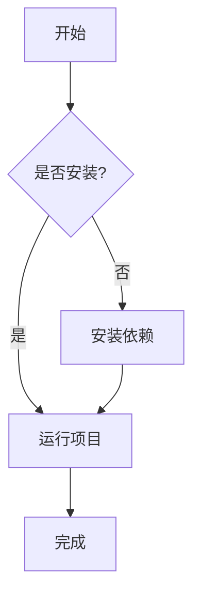
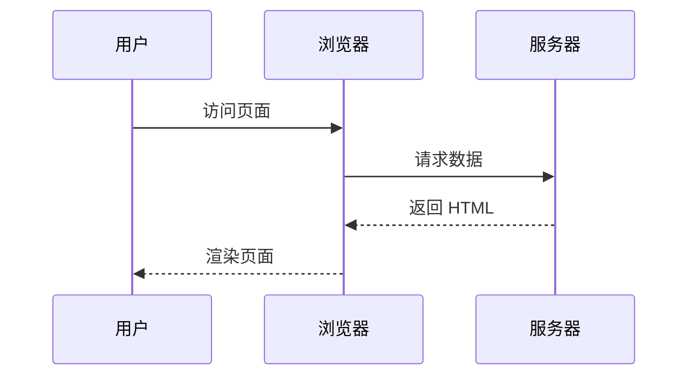
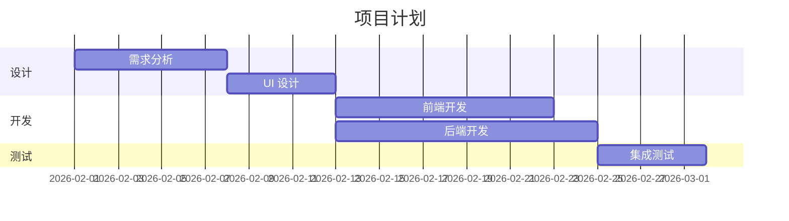
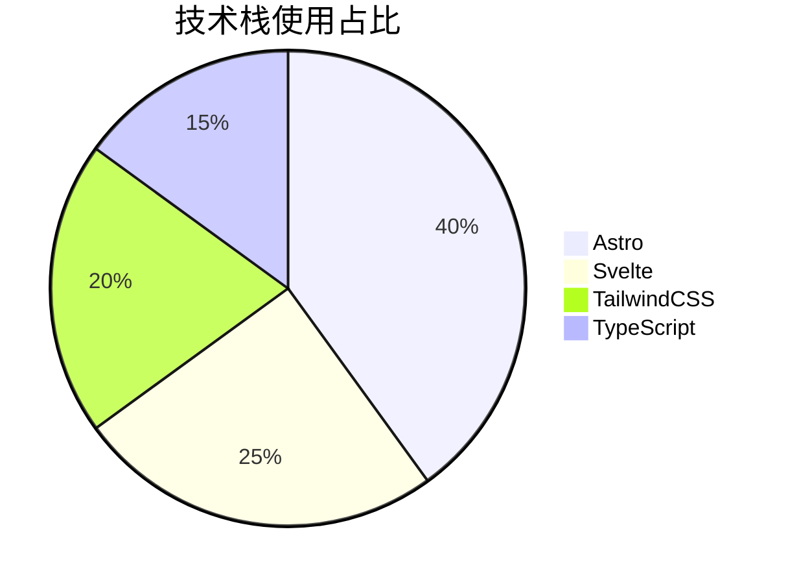
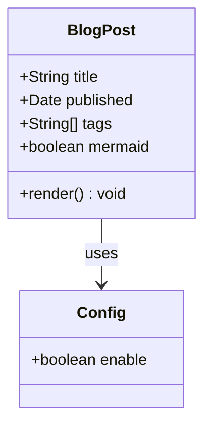

## Mermaid 图表测试

本文用于验证 Mermaid 图表渲染功能是否正常工作。

### 流程图 (Flowchart)



### 序列图 (Sequence Diagram)



### 甘特图 (Gantt Chart)



### 饼图 (Pie Chart)



### 类图 (Class Diagram)



### 普通代码块（不受影响）

下面的代码块应该正常高亮，不会被 Mermaid 处理：

```javascript
const config = {
  mermaid: {
    enable: true,
  },
};
console.log("Hello Mermaid!");
```
